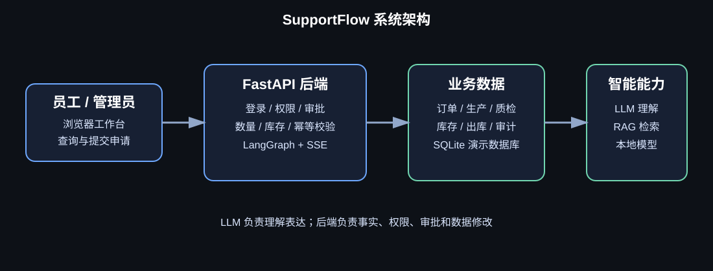
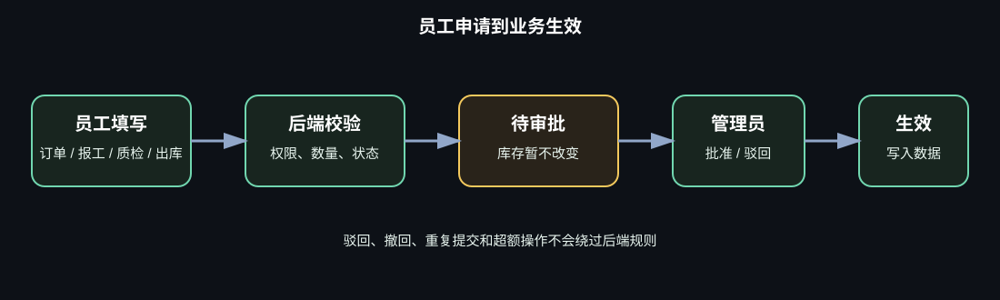

# 永好塑胶订单运营助手

一个面向塑胶制品制造场景的内部订单、生产、质检与库存协同系统。

项目以永好塑胶制品（深圳）有限公司的内部业务场景为背景，围绕塑胶载体卷轴等产品，模拟业务员、生产员工、质检员工、仓库员工和管理员之间的日常协作。

> 这是学习、作品集和流程演示项目。仓库中的客户、订单、库存和生产数据均为虚构演示数据，不包含公司真实业务数据。

## 项目解决什么问题

小型制造企业中，客户订单、生产进度、质检结果和库存信息容易分散在 Excel、聊天记录和纸质台账中。这个系统把这些信息集中到一个内部工作台中：

- 业务员提交客户订单；
- 管理员审批订单并查看整体进度；
- 生产员工申报完成数量；
- 质检员工提交合格/不合格数量；
- 仓库员工提交出库申请；
- 管理员统一审批，并在审批通过后真正修改业务数据；
- 员工通过个人看板查看自己的工作量和申请状态；
- 管理员通过总看板查看订单、生产、质检、库存和待审批事项。

## 系统预览

### 整体架构



### 员工申请与管理员审批



> GitHub 会直接渲染仓库内的 SVG 图片。后续可以在 `docs/images/` 中补充实际工作台截图。

## 核心功能

### 1. 账号与权限

- 员工注册和登录；
- 新员工注册后默认获得基础业务权限，可以正常进入系统；
- 管理员可以查看员工账号并增删权限；
- 后端接口再次校验权限，前端隐藏按钮不是安全边界；
- 员工只能提交申请，不能直接审批或修改核心业务数据。

| 账号类型 | 主要工作 |
| --- | --- |
| 业务员 | 查询订单和物流，提交客户订单 |
| 生产员工 | 查询订单和生产进度，提交生产报工 |
| 质检员工 | 查询订单和生产进度，提交质检结果 |
| 仓库员工 | 查询订单、库存和物流，提交出库申请 |
| 管理员 | 查看全局数据、管理权限、审批申请、直接创建订单 |

### 2. 订单管理

- 员工提交客户订单申请；
- 管理员审批或驳回员工提交的订单；
- 管理员可以直接创建已批准订单；
- 订单包含客户、产品 SKU、规格、需求数量、单价和交期；
- 订单可以关联生产任务、质检记录、库存和出库记录；
- 支持通过聊天入口查询订单需求量、完成量和剩余量。

### 3. 生产报工

- 员工提交订单的生产完成数量；
- 申请先进入待审批状态；
- 管理员批准后才写入生产记录；
- 报工数量不能为零、负数或非法数字；
- 累计完成量不能超过订单需求数量；
- 员工可以查看自己的报工记录和审批状态。

### 4. 质检管理

- 提交检验数量、合格数量和不合格数量；
- 后端校验：

```text
合格数量 + 不合格数量 = 检验数量
```

- 员工无质检权限时，不能通过聊天或接口绕过权限；
- 质检结果经过管理员审批后进入正式记录；
- 管理员看板可以汇总检验量、合格量和不良量。

### 5. 库存与出库

- 查询产品、仓库、批次和可用库存；
- 仓库员工提交出库申请；
- 出库申请审批前库存不变；
- 管理员批准时重新读取当前库存；
- 出库数量不能超过订单剩余数量；
- 库存不足时拒绝出库，不产生部分扣减；
- 审批成功后写入库存流水和订单发货数量。

### 6. 员工和管理员看板

员工看板包括：

- 我的待审批申请；
- 今日/累计生产报工量；
- 今日/累计质检量；
- 最近订单申请、报工、质检和出库状态；
- 驳回原因和可重新提交的信息。

管理员看板包括：

- 订单数量和订单状态汇总；
- 总需求量、完成量、发货量；
- 库存总量和可用库存；
- 合格量、不良量和质检统计；
- 员工工作量；
- 待审批申请列表；
- 批准、驳回和审批历史；
- 员工账号及权限管理。

## 业务状态示例

```text
订单申请：SUBMITTED → APPROVED / REJECTED
生产报工：SUBMITTED → APPROVED / REJECTED / FAILED
质检申请：SUBMITTED → APPROVED / REJECTED / FAILED
出库申请：SUBMITTED → APPROVED / REJECTED / FAILED
```

所有写入型操作遵循：

```text
员工提交
  → 后端确定性校验
  → 等待管理员审批
  → 审批时重新读取订单/库存/权限
  → 校验通过后才修改数据库
```

## LLM 在系统中的作用

LLM 是自然语言入口，不是管理员，也不是数据库。

### LLM 可以做什么

- 理解“SF2002 现在完成多少了”对应订单/生产查询；
- 理解“给客户 CUST-001 下 500 个黑色卷轴”对应订单申请；
- 发现缺少订单号或数量时，用自然语言追问；
- 把后端已经查到的订单、库存和生产结果整理成易读回答。

### LLM 不能做什么

- 不能给员工授予权限；
- 不能批准订单、报工、质检或出库；
- 不能直接修改库存、订单状态或完成数量；
- 不能把用户声称的库存、订单总量当成可信事实；
- 不能绕过数量校验、审批和幂等控制。

查询问题优先使用后端确定性查询；写入问题必须进入申请、审批和后端验证流程。

## 技术架构

```text
浏览器
  ↓
TanStack Start + Cloudflare Worker 前端（可选）
  ↓ /api 代理
FastAPI 后端
  ├── 登录、会话与权限
  ├── LangGraph 多轮对话与检查点
  ├── 确定性业务工具
  ├── SQLite 演示数据库
  ├── BM25 / Dense / RRF / BGE 本地检索链
  └── 可选 DeepSeek Provider
```

主要技术：

- Python 3.11+
- FastAPI
- LangGraph
- Pydantic
- SQLite
- BM25、Dense Embedding、RRF、BGE Reranker
- React + TanStack Start
- Cloudflare Workers
- Docker CPU-only

## 制造运营 Agent 架构

SupportFlow 当前把“实时业务事实”和“稳定业务知识”分开处理：

```text
用户问题
  ↓
LangGraph 路由
  ├── 订单 / 库存 / 生产 / 质检 / 审批状态
  │     └── SQLite + 确定性业务工具
  ├── 制造 SOP / 质检处理规范 / 包装 / 出库规范
  │     └── manufacturing_demo Hybrid RAG
  └── 写操作
        └── 权限 → 参数校验 → 申请 → 管理员审批 → 执行时重新校验
```

### 双 Corpus 边界

系统有两个互相隔离的检索 Corpus：

| Corpus | 内容 | 当前用途 |
| --- | --- | --- |
| `customer_support` | 历史客服知识，例如退款、退货、物流和售后 | 保留原有客服知识问答 |
| `manufacturing_demo` | 5 份明确标记为 synthetic/demo 的制造演示规范 | 生产前核对、质检处理、卷轴包装、出库和审批流程问答 |

制造 Corpus 不包含订单数量、库存、报工数量或审批结果等实时事实；这些信息只能从 SQLite 和确定性工具读取。制造查询必须显式指定 `manufacturing_demo`，不会缺失时回退到客服 Corpus。文档检索还会按 `allowed_roles` 和 `effective_status=active` 做确定性过滤。

### Hybrid RAG 流程

制造稳定知识问题沿用现有检索链：

```text
指定 Corpus
  → BM25 关键词检索
  → Dense Embedding 语义检索
  → RRF 融合
  → 本地 BGE Reranker 重排
  → Evidence Judge
  → Grounded Generation 或 Safe Fallback
```

Evidence 会保留 `corpus`、`document_id`、`chunk_id`、`source_version`、`source_section` 等来源信息。当前制造 Demo 是文档级检索，5 份文档尚未切分，因此 `chunk_id=None` 是当前真实状态，不代表已经实现了细粒度 chunk 检索。

### 三个验收场景

- **场景 A：制造 SOP 问答**：只从 `manufacturing_demo` 读取稳定规范；证据不足、文档无权限或模型失败时安全兜底。
- **场景 B：质检混合查询**：SQLite 提供某个订单的质检事实，制造 SOP 只提供通用处理规范；两类来源在 Trace 中分开记录。当前 `quality_reports` 没有独立缺陷原因字段，因此系统不会凭 SOP 编造具体原因。
- **场景 C：出库申请与审批**：员工聊天或表单提交申请，后端校验订单剩余数量和库存，申请先进入 `SUBMITTED`；审批前不扣库存，管理员批准时再次校验并执行，拒绝或条件变化时不执行。

### 权限、审批和 Trace

- 权限由后端登录身份和确定性 Python 逻辑决定，LLM、用户文本、RAG 文档和前端字段都不能授予权限。
- 员工拥有相应的查询或提交权限，但不能直接审批或修改订单、库存和报工数据；管理员负责审批和管理员看板。
- 申请、审批、执行分离；审批时重新检查订单、数量、库存和审批人权限。
- `/chat` 与 `/chat/stream` 共用 LangGraph 主链，Trace 记录路由、Corpus、来源 ID、Answerability、Generation/Fallback 和阶段耗时；制造混合质检额外区分数据库来源和 SOP 来源。
- 当前 Graph 使用 `InMemorySaver`，会话检查点只存在进程内，服务重启后不会持久化。

## B4.1 历史真实 Hybrid RAG 证据

以下是 B4.1 已完成的本地离线烟雾测试记录，不是本次 B6-A 新执行，也不是生产准确率评估：

- Dense：`paraphrase-multilingual-MiniLM-L12-v2`，本地缓存，CPU，`local_files_only=True`。
- BGE：`BAAI/bge-reranker-v2-m3`，本地 `D:\models\bge-reranker-v2-m3`，CPU，未联网下载。
- 5 个固定 Gold 查询分别覆盖生产前核对、质检隔离复检、卷轴包装、出库交接、审批流程；BGE Top-1 均命中人工预先定义的 Gold 文档。
- 该结果只能说明这 5 个 Demo 查询在当时本地环境完成了真实 BM25 → Dense → RRF → BGE 路径烟雾验证，不能称为生产环境准确率或真实客户指标。
- BGE CPU 推理是主要延迟来源：历史单查询 BGE 重排约 1.28–2.10 秒，首次模型加载还存在冷启动成本。

## Demo 数据与真实性边界

- `data/manufacturing_knowledge_demo.json` 只有 5 份制造文档，全部 `synthetic=true`、`authority=teaching_demo_only`；它们是教学/作品集演示规则，不是永好塑胶的正式制度，也不代表国家或行业标准。
- 文档当前按文档级返回，`chunk_id=None`；不要在简历中描述为已经完成细粒度知识库切片。
- 订单、库存、生产、质检、出库和审批数据是虚构 SQLite 演示数据；不会把真实客户数据或公司机密提交到仓库。
- 5 个制造 Gold 查询只是本地 Smoke Test，不能代表生产准确率、召回率或真实客户效果。
- 质检数据库当前没有独立的缺陷原因字段；没有记录时，系统必须明确说明未知，不能从 SOP 推断具体订单原因。
- 出库审批当前按现有业务规则重新校验订单剩余数量、当前库存和审批权限；它不是完整 ERP，也没有宣称覆盖所有企业订单状态规则。
- 当前 SQLite、进程内检查点和单级管理员审批适合本地/小规模演示，不宣称生产级部署、高并发能力或真实客户指标。

## 本地运行

### 环境要求

- Python 3.11 或更高版本；
- Node.js 20 或更高版本（仅构建 Worker 前端需要）；
- Docker Desktop（可选）；
- 本地 Dense 模型缓存和 BGE Reranker 模型（启用真实检索时需要）。

### 启动后端

```powershell
Copy-Item .env.example .env
python -m venv .venv
.\.venv\Scripts\Activate.ps1
pip install -r requirements.txt
python -m uvicorn app.api:api --host 127.0.0.1 --port 8001
```

打开：

```text
http://127.0.0.1:8001/
```

健康检查：

```text
GET /health       检查进程是否存活
GET /readiness    检查本地模型和启动资源是否准备完成
```

### 生成演示账号

密码只从本地 `.env` 读取，不写入代码、不打印到日志：

```powershell
python scripts/seed_demo_accounts.py
```

示例账号密码请自行配置在未提交的 `.env` 中，不要写入 README 或 GitHub。

## 本地模型配置

```text
SUPPORTFLOW_ENABLE_DENSE_RETRIEVAL=true
SUPPORTFLOW_EMBEDDING_MODEL=paraphrase-multilingual-MiniLM-L12-v2
SUPPORTFLOW_EMBEDDING_DEVICE=cpu
SUPPORTFLOW_RERANKER_PATH=D:\models\bge-reranker-v2-m3
SUPPORTFLOW_RERANKER_DEVICE=cpu
```

模型必须通过本地缓存或本地目录加载。运行时不应偷偷访问 Hugging Face 下载模型。

## Cloudflare Worker 部署

`frontend/` 是独立的 TanStack Start 前端项目。Cloudflare Worker 只负责网页和 `/api/*` 代理，FastAPI 后端仍负责数据库、本地模型、权限和 DeepSeek 调用。

```powershell
cd frontend
npm install
npm run build
npx.cmd wrangler login
npx.cmd wrangler deploy --var "BACKEND_ORIGIN:https://你的后端公网地址"
```

注意：

- `BACKEND_ORIGIN` 不能填写 `http://127.0.0.1:8001`；
- 临时演示可以使用 Quick Tunnel，但本机后端和隧道必须一直运行；
- 稳定内部使用需要一台长期在线的服务器或办公电脑；
- DeepSeek API Key 只放在后端运行环境，不进入 Worker 前端和 GitHub。

## Docker 部署

模型不复制进镜像，而是使用只读 Bind Mount：

```powershell
docker build -t supportflow-agent:v1.4 .
docker run --rm -p 8001:8001 `
  --mount "type=bind,source=D:\models\bge-reranker-v2-m3,target=/models/bge-reranker-v2-m3,readonly" `
  --env-file .env `
  -e SUPPORTFLOW_ENABLE_DENSE_RETRIEVAL=true `
  -e SUPPORTFLOW_RERANKER_PATH=/models/bge-reranker-v2-m3 `
  -e HF_HUB_OFFLINE=1 `
  -e TRANSFORMERS_OFFLINE=1 `
  supportflow-agent:v1.4
```

## 测试

运行自动化测试：

```powershell
pytest -q
```

自动化测试使用 Fake/Mock Provider，不调用真实 DeepSeek。当前版本完整测试结果为：

```text
137 passed
```

B6-A 最终验收时的实测结果为 `137 passed in 38.52s`；其中 A/B/C 相关回归测试为 `22 passed in 3.12s`。测试套件不触发真实 DeepSeek，也不下载模型。

真实 DeepSeek Smoke Test 是单独的显式操作：

```powershell
python scripts/smoke_test_deepseek.py
```

这个命令可能产生真实 API 调用，只有在明确需要验证 Provider 时才运行。

## 数据与安全边界

- `data/supportflow_demo.db` 是本地生成的 SQLite 演示数据库；
- `.env` 被 `.gitignore` 忽略；
- `.env.example` 不包含真实 Secret；
- 数据库文件、日志、模型目录和前端构建产物不提交；
- 密码以哈希形式保存，不在 README、日志或 Trace 中显示；
- 订单、库存、权限和审批状态以后端数据库为准；
- 所有写入操作都经过后端权限、参数、状态和幂等校验；
- 拒绝非法请求时不返回 API Key、环境变量或堆栈信息。
- B0 架构审计和 B1-B6 实施计划保存在 `docs/` 中，属于阶段性历史规划文档；它们记录过时计划时，以当前代码和本 README 为准，不应当被当作全部已实现功能。

## 项目目录

```text
app/                 FastAPI、LangGraph 和业务逻辑
data/                虚构业务数据、知识库和评估结果
docs/                业务目标、架构图和可靠性说明
frontend/            TanStack Start + Cloudflare Worker 前端
scripts/             演示账号、Smoke Test 和评估脚本
tests/               Fake Provider 自动化测试
Dockerfile           CPU-only 后端镜像
.env.example         无 Secret 的配置模板
```

## 当前限制

- 当前 SQLite 和内存检查点适合本地/小规模演示，不适合高并发生产环境；
- 真实公司数据需要经过字段确认、权限审查和脱敏/授权流程后才能接入；
- 当前管理员审批是单级审批；
- Cloudflare Worker 依赖单独运行且可公网访问的 FastAPI 后端；
- 当前是阶段事件流，不是逐 Token 的生成流；
- InMemorySaver 不提供跨进程或重启后的持久化会话；
- 制造 Demo Corpus 只有 5 份 synthetic 文档，且当前 `chunk_id=None`；
- QA 数据没有独立缺陷原因字段，混合查询不能凭空补充具体缺陷；
- BGE 在 CPU 上推理有明显冷启动和单次重排延迟；
- 出库审批只实现当前演示业务规则，不宣称替代完整 ERP/MES/WMS；
- 5 个 Gold 查询只用于本地 Smoke Test，不是生产准确率或客户指标；
- LLM 只提供自然语言理解和回答组织能力，系统不宣称零幻觉或百分之百自动化。

## 项目状态

第一版制造运营核心流程已经完成：账号权限、订单申请、管理员审批、生产报工、质检、库存、出库、员工看板、管理员看板、LLM 查询入口和安全校验均已接入，并通过自动化回归测试。

后续真正上线前，优先确认真实业务字段、导入经授权的数据、选择持久化数据库，并将 FastAPI 后端部署到长期在线且受控的机器上。
